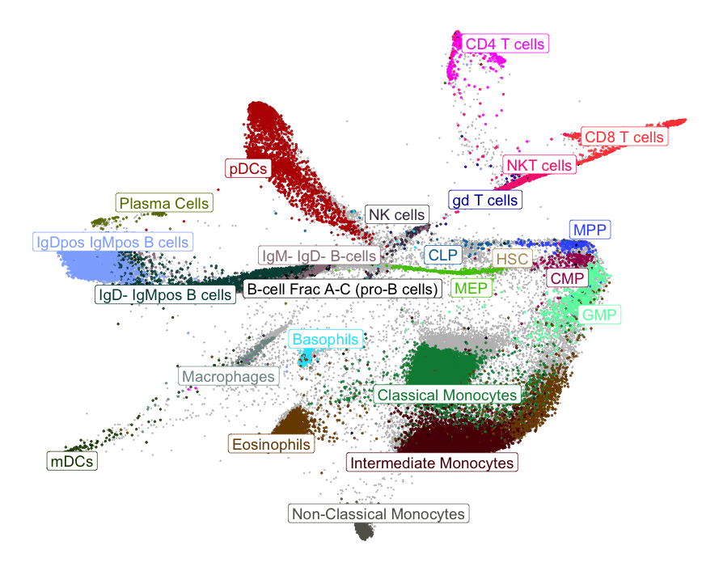

# cyen

*Projection of high-dimensional cytometry data using regularised autoencoders*

See *poster.pdf* for the poster presented at CYTO 2022.

See *ModelTrainingAnimations* for animated GIFs of how each set-up trains to produce a 2-dimensional layout.

See *github.com/davnovak/npe_faster* for calculating population structure loss (based on the Neighbourhood Proportion Error).

Manuscript is on the way--stay tuned for code.

Alternatively, just send me an e-mail at *davidnovakcz@hotmail.com* to arrange any collaborations.
